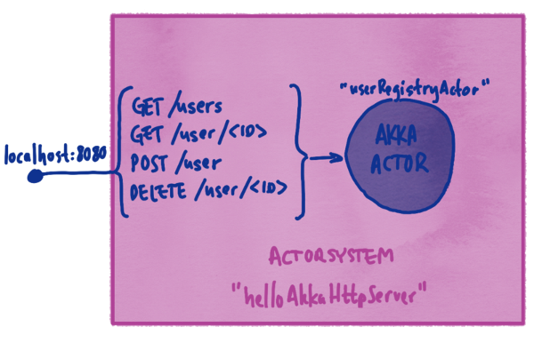

Akka HTTP Quickstart with Scala
===============================

The Akka HTTP modules implement a full server- and client-side HTTP stack on top of akka-actor and akka-stream.  It’s not a web-framework but rather a more general toolkit for providing and consuming HTTP-based services.  While interaction with a browser is of course also in scope, it is not the primary focus of Akka HTTP.

Akka HTTP follows a rather open design and many times offers several different API levels for "doing the same thing."  The users get to pick the API level of abstraction that is most suitable for their applications.  This approach means that, if you have trouble achieving something using a high-level API, there’s a good chance that you can get it done with a low-level API, which offers more flexibility but might require you to write more application code.

This Hello World example demonstrates some Akka HTTP fundamentals. Within 30 minutes, you should be able to download, run the sample application, and use this documentation to guide you through this example's building blocks.

## Prerequisite

Having a basic understanding of Akka actors will help the reader of this guide. There is a [Quickstart guide](https://developer.lightbend.com/guides/akka-quickstart-scala/) for Akka actors should you feel like brushing up your knowledge thereof.

## Downloading the example

The Hello World example for Scala is a zipped project that includes a distribution of sbt (build tool). You can run it on Linux, MacOS, or Windows. The only prerequisite is Java 8.

Download and unzip the example:

1. Download the zip file from Lightbend Tech Hub by clicking `CREATE A PROJECT FOR ME`.
2. Extract the zip file to a convenient location:

* On Linux and MacOS systems, open a terminal and use the command `unzip` akka-quickstart-scala.zip. Note: On OSX, if you unzip using Archiver, you also have to make the sbt files executable:

```
$ chmod u+x ./sbt
$ chmod u+x ./sbt-dist/bin/sbt
```

* On Windows, use a tool such as File Explorer to extract the project.

## Running the example

To run Hello World:

In a console, change directories to the top level of the unzipped project.

For example, if you used the default project name, `akka-http-quickstart-scala`, and extracted the project to your root directory, from the root directory, enter:

Enter `./sbt` on OSX/Linux or run `sbt.bat` on Windows to start [sbt](http://www.scala-sbt.org).

sbt downloads project dependencies. The `>` prompt indicates sbt has started in interactive mode.

At the sbt prompt, enter `run`.

OSX/Linux
: ```
$ cd akka-http-quickstart-scala
$ ./sbt
> run
```

Windows
: ```
$ cd akka-http-quickstart-scala
$ sbt.bat
> run
```

sbt builds the project and runs Hello World.

The output should look something like this:

```
[info] Loading global plugins from /Users/x/.sbt/0.13/plugins
...
[info] Running com.lightbend.akka.http.sample.QuickstartServer
Server online at http://localhost:8080/
Press RETURN to stop...
```

The command above will start an Akka HTTP server. We will look at how to invoke the available endpoints of the server later in this guide.

Congratulations, you just ran your first Akka HTTP app. Now take a look at what happened under the covers.

## What Hello World does

In this example, a simple user registry service represented by an actor is presented to consumers as a [REST service](https://en.wikipedia.org/wiki/Representational_state_transfer).

When Hello World starts up, it creates an ActorSystem and an instance of the `UserRegistryActor` that implements the functionality of the service. Then the HTTP service is started by binding so-called "routes" to the given interface and port, in this case, `localhost:8080`. Below is an overview of what things look like after the application has started:



The value `routes` defines the endpoint `/users` that route requests to the business logic actor. Routes are defined in terms of so-called "directives" which are basic building blocks of Akka Http that define how requests and responses are handled and how data is translated from HTTP to and from your domain objects.

In the following sections, we will take a detailed look at the individual pieces of this application.

## The Akka HTTP philosophy

Akka HTTP is designed specifically as "not-a-framework," not because we don’t like frameworks, but for use cases where a framework is not the right choice.  Akka HTTP is for building integration layers based on HTTP and as such tries to "stay on the sidelines."  Therefore, a typical application doesn't sit on top of Akka HTTP but instead on top of whatever makes sense and uses Akka HTTP merely for the HTTP integration needs. Should you look for a web framework it is recommended to take a look at the [Play framework](https://www.playframework.com/).

@@@index

* [The backend](backend.md)
* [The server](server-class.md)
* [JSON](json.md)
* [Running the application](running-the-application.md)
* [IntelliJ IDEA](intellij-idea.md)

@@@
