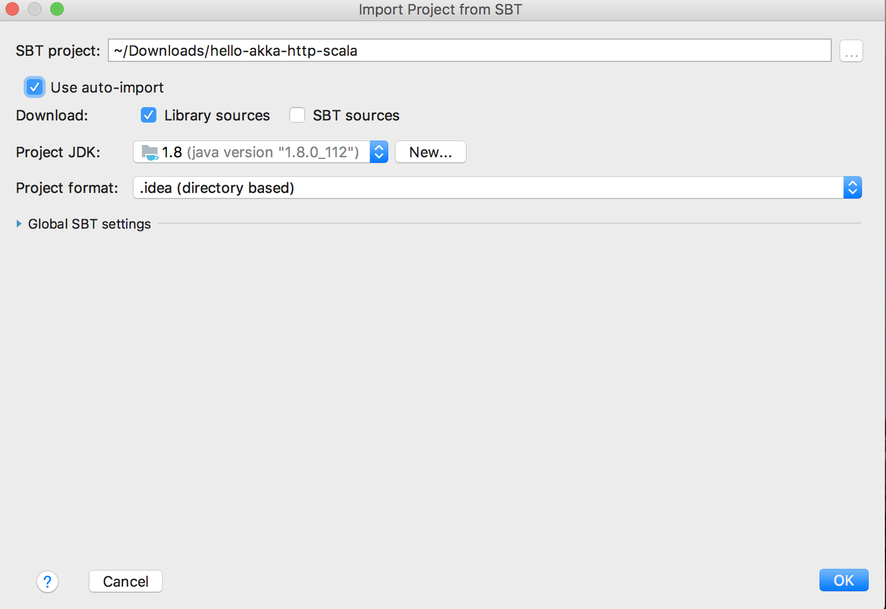
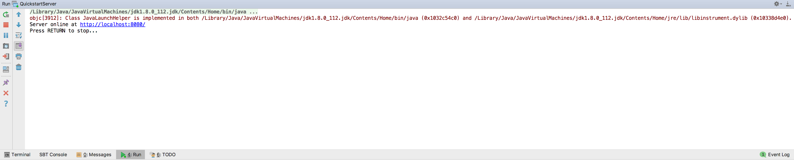

IntelliJ IDEA
-------------

[IntelliJ IDEA](https://www.jetbrains.com/idea/) from JetBrains is one of the leading IDEs in the Java/Scala community, and it has excellent support for Akka HTTP. This section of the tutorial describes how to set up, test and run the sample project in IntelliJ.

## Setting up the project

To add the Akka HTTP example project to IntelliJ, follow these steps:

1. Open IntelliJ.
1. Select **Open** from the Welcome dialog or **File &gt; Open** from the Editor.
1. Browse to select the top-level directory of the sample project and click **OK**.

## Removing comments

The main source file contains comments with special directives used by the documentation. To get rid of these lines, you can use IntelliJ's awesome find and replace functionality. Follow these steps:

1. From the Project pane, open the `QuickstartServer` source file.
1. From the **Edit** menu, select **Find &gt; Replace**.
1. Enter (//#).* into the find box.
1. Check **Regex**.
1. Click **Replace**.

Voila the lines are gone!

## Running the application

In the **Project** pane, right click the `QuickstartServer` source file. Select **Run 'QuickstartServer'**. The output should look like the output in the shell:

## Tutorial done!

Congratulations! You can start building real-world applications that use Akka HTTP. Of course, we didn't have time to cover all Akka HTTP features in this short guide. See the @extref[documentation](akka.http:scala/http/index.html) to learn more.
